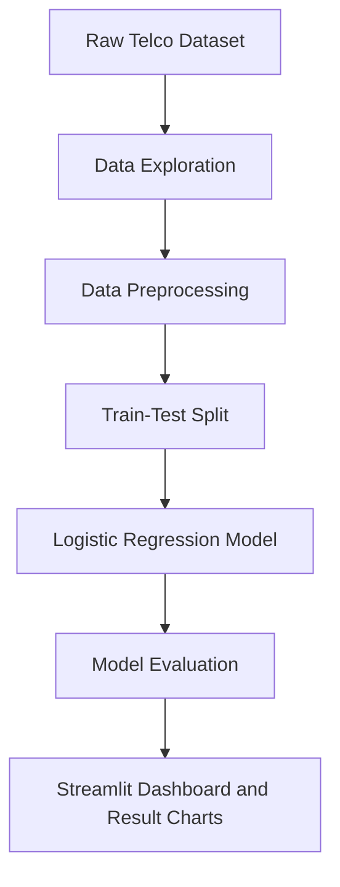

# Customer Churn Prediction using Classification

Data Mining mini project for predicting telecom customer churn using a Logistic Regression classification model.

## Project Links

* **Live Streamlit App:** https://auramining.streamlit.app
* **Dataset:** IBM Telco Customer Churn dataset, publicly available on Kaggle
* **Dataset Link:** https://www.kaggle.com/datasets/blastchar/telco-customer-churn
* **Dataset File Used:** `data/raw/WA_Fn-UseC_-Telco-Customer-Churn.csv`

## Problem Statement

Customer churn means customers stop using a company's service. In the telecom industry, churn directly affects revenue and business growth. The objective of this project is to predict whether a customer is likely to churn based on customer demographics, account details, service usage, contract type, payment method, monthly charges, and tenure.

This is a real-world **classification** problem because the target variable has two classes: `Churn = Yes` and `Churn = No`.

## Dataset Overview

* **Dataset Name:** Telco Customer Churn Dataset
* **Source:** IBM/Kaggle public dataset
* **Number of Records:** 7043 customers
* **Raw Columns:** 21
* **Target Variable:** `Churn`

Important attributes include:

* `gender`, `SeniorCitizen`, `Partner`, `Dependents`
* `tenure`, `Contract`, `PaymentMethod`
* `PhoneService`, `InternetService`, `OnlineSecurity`, `TechSupport`
* `MonthlyCharges`, `TotalCharges`

## Methodology

The project follows a standard data mining workflow:



## Data Preprocessing

The following preprocessing steps were performed:

* Converted `TotalCharges` from text/object format to numeric.
* Handled missing `TotalCharges` values using median imputation.
* Removed `customerID` because it is only an identifier.
* Encoded categorical variables using One-Hot Encoding.
* Scaled continuous numerical features:
    * `tenure`
    * `MonthlyCharges`
    * `TotalCharges`
* Used a leakage-safe pipeline where imputation, encoding, and scaling are fitted only on the training data.

## Technique Used

* **Data Mining Technique:** Classification
* **Algorithm:** Logistic Regression
* **Reason:** Logistic Regression is suitable for binary classification problems and provides interpretable coefficients for understanding churn-related factors.

## Implementation Details

Tools and libraries used:

* Python
* pandas
* scikit-learn
* matplotlib
* seaborn
* Streamlit
* VS Code

Training parameters:

```text
test_size = 0.2
random_state = 42
stratify = y
solver = lbfgs
max_iter = 1000
```

## Results

Model performance on the test set:

| Metric | Value |
|---|---:|
| Accuracy | 0.8055 |
| Precision | 0.6572 |
| Recall | 0.5588 |
| F1-Score | 0.6040 |

Confusion matrix:

```text
[[926 109]
 [165 209]]
```

## Result Graphs and Screenshots

### Churn Distribution

Shows the number of customers who churned and did not churn.


### Churn Rate by Contract Type

Shows that month-to-month contract customers have the highest churn rate.


### Monthly Charges by Churn

Compares monthly charges for churned and non-churned customers.


### Confusion Matrix

Shows correct and incorrect model predictions.


### Top Model Coefficients

Shows the most influential Logistic Regression features.


## How to Run in VS Code

Open the `data_mining_project` folder in VS Code.

Run the complete analysis:

```bash
python3 src/run_in_vscode.py
```

If you are in the outer `DM assignment` folder, run:

```bash
python3 data_mining_project/src/run_in_vscode.py
```

This prints the model results in the terminal and saves graph images to:

```text
reports/figures/
```

You can also use the VS Code **Run and Debug** panel:

* `Run Assignment Analysis`
* `Run Streamlit Dashboard`

## How to Run Streamlit Locally

Install dependencies:

```bash
python3 -m pip install -r requirements.txt
```

Run the dashboard:

```bash
python3 -m streamlit run src/app.py
```

## Project Structure

```text
data_mining_project/
├── data/
│   ├── raw/
│   └── processed/
├── reports/
│   ├── figures/
│   ├── project_report.md
│   └── presentation_outline.md
├── src/
│   ├── app.py
│   ├── data_exploration.py
│   ├── data_preprocessing.py
│   ├── model_training.py
│   └── run_in_vscode.py
├── requirements.txt
└── README.md
```

## Conclusion

The project successfully applies a classification model to predict telecom customer churn. The Logistic Regression model achieved **80.55% accuracy**. The analysis shows that contract type, tenure, internet service type, payment method, and monthly charges are important factors related to churn.

## Future Scope

* Try advanced models such as Random Forest, XGBoost, or Gradient Boosting.
* Improve recall for churn customers.
* Handle class imbalance using SMOTE.
* Perform hyperparameter tuning.
* Extend the dashboard with customer-level prediction input.
