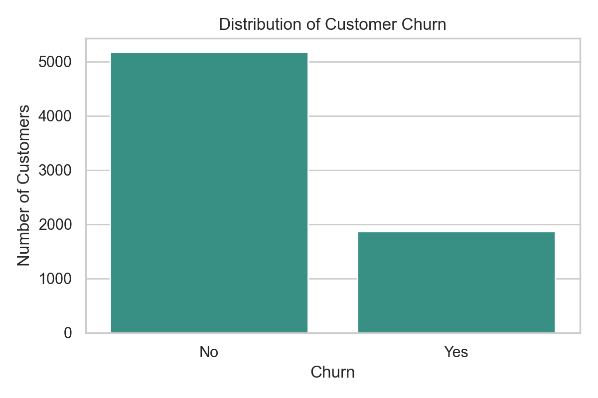
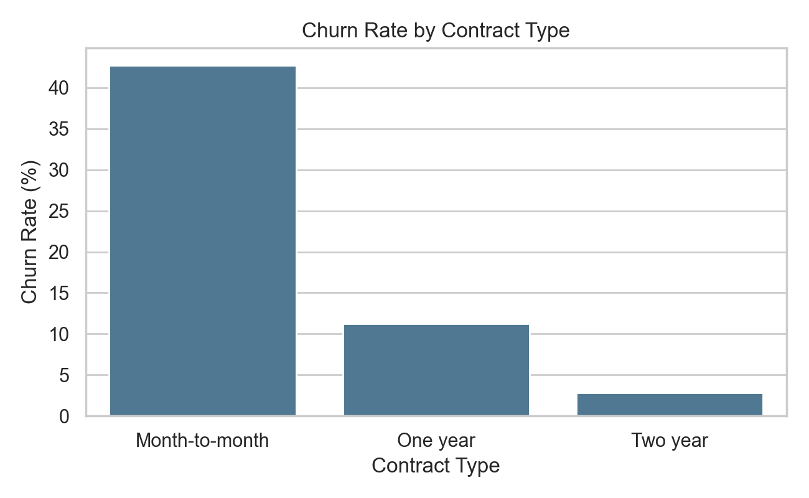
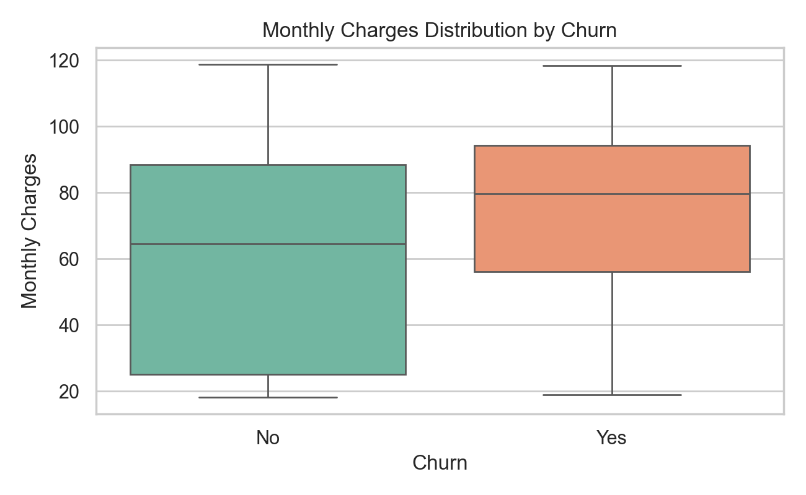
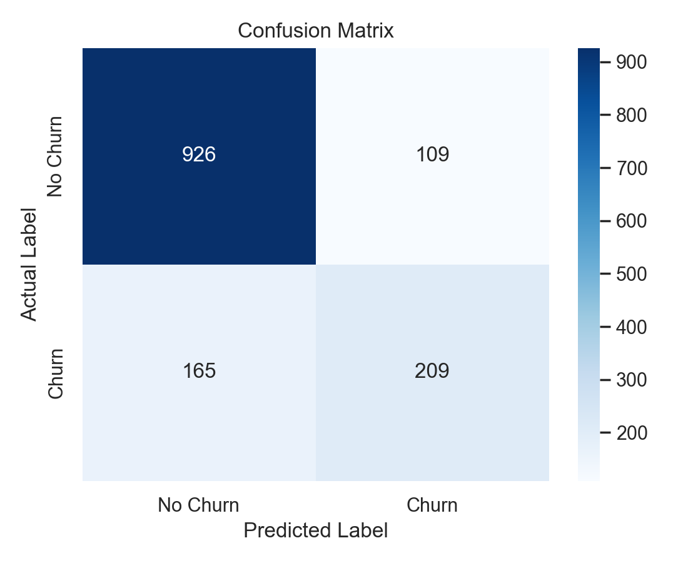
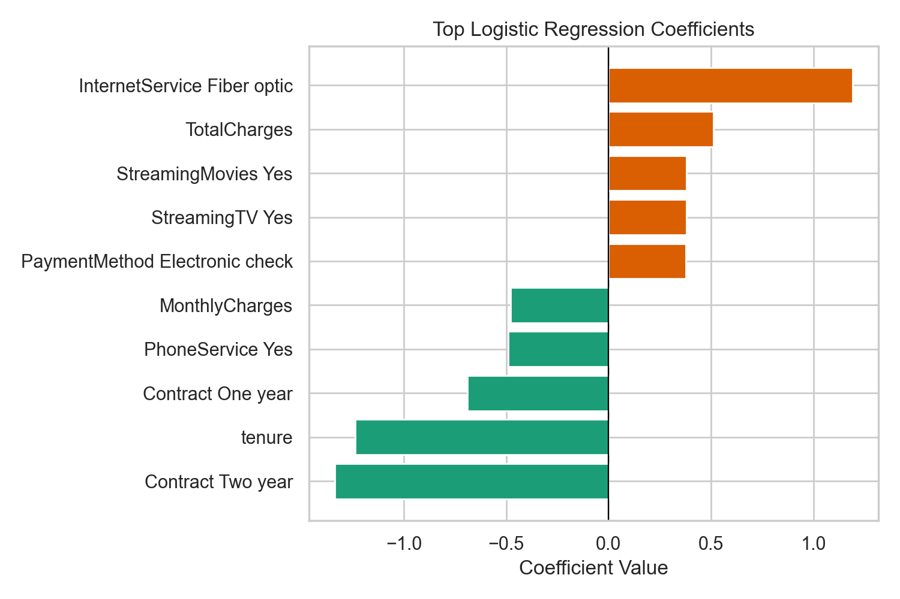

# Data Mining Mini-Project Report: Customer Churn Prediction

Course: **Data Mining (CSC302A)**  
Semester/Batch: **6th / 2023**  
Student Name: **Puneeth R V**  
Register No: **23ETCS002094**  
University: **Faculty of Engineering and Technology, Ramaiah University of Applied Sciences**  

---

## 1. Problem Definition
Customer churn, also known as customer attrition, refers to the phenomenon where customers stop doing business with a company or service. Predicting customer churn is a critical business problem for many industries, including telecommunications, streaming services, and banking. Retaining existing customers is often more cost-effective than acquiring new ones. By identifying customers at risk of churning, companies can proactively implement retention strategies, such as targeted offers or improved customer service, to prevent their departure.

**Objective:** The primary objective of this mini-project is to build a classification model that accurately predicts whether a telecommunications customer will churn or not, based on their demographic information, service usage, and contract details.

---

## 2. Dataset Description
The dataset used in this project is the **Telco Customer Churn** dataset, which is publicly available on Kaggle. It was created by IBM to demonstrate customer retention programs. The dataset represents a telecommunications company's customer base, including their service options, demographics, account status, and churn status.

The dataset contains a total of **7,043 instances** (customers) and **21 attributes** (20 features and 1 target variable `Churn`). The attributes can be classified into four primary categories: customer demographics, account details, services subscribed, and the target variable.

### Attribute Details:
| Category | Attribute Name | Data Type | Description |
| :--- | :--- | :--- | :--- |
| **Demographics** | `gender` | Categorical (Binary) | Whether the customer is male or female |
| **Demographics** | `SeniorCitizen` | Categorical (Binary) | Whether the customer is a senior citizen (1, 0) |
| **Demographics** | `Partner` | Categorical (Binary) | Whether the customer has a partner (Yes, No) |
| **Demographics** | `Dependents` | Categorical (Binary) | Whether the customer has dependents (Yes, No) |
| **Account Details** | `tenure` | Numerical (Continuous) | Number of months the customer has stayed with the company |
| **Account Details** | `Contract` | Categorical (Multi-class) | The contract term of the customer (Month-to-month, One year, Two year) |
| **Account Details** | `PaperlessBilling` | Categorical (Binary) | Whether the customer has paperless billing (Yes, No) |
| **Account Details** | `PaymentMethod` | Categorical (Multi-class) | The customer's payment method (Electronic check, Mailed check, automatic methods) |
| **Account Details** | `MonthlyCharges` | Numerical (Continuous) | The amount charged to the customer monthly |
| **Account Details** | `TotalCharges` | Numerical (Continuous) | The total amount charged to the customer |
| **Services** | `PhoneService` | Categorical (Binary) | Whether the customer has a phone service (Yes, No) |
| **Services** | `MultipleLines` | Categorical (Multi-class) | Whether the customer has multiple lines (Yes, No, No phone service) |
| **Services** | `InternetService` | Categorical (Multi-class) | Customer's internet service provider (DSL, Fiber optic, No) |
| **Services** | `OnlineSecurity` | Categorical (Multi-class) | Whether the customer has online security (Yes, No, No internet service) |
| **Services** | `OnlineBackup` | Categorical (Multi-class) | Whether the customer has online backup (Yes, No, No internet service) |
| **Services** | `DeviceProtection` | Categorical (Multi-class) | Whether the customer has device protection (Yes, No, No internet service) |
| **Services** | `TechSupport` | Categorical (Multi-class) | Whether the customer has tech support (Yes, No, No internet service) |
| **Services** | `StreamingTV` | Categorical (Multi-class) | Whether the customer has streaming TV (Yes, No, No internet service) |
| **Services** | `StreamingMovies` | Categorical (Multi-class) | Whether the customer has streaming movies (Yes, No, No internet service) |
| **Target Variable** | `Churn` | Categorical (Binary) | Target variable indicating whether the customer churned (Yes, No) |

---

## 3. Data Preprocessing
Data preprocessing is a critical step in the data mining process. It involves cleaning and transforming raw data into a format suitable for building machine learning models. The following preprocessing steps were performed on the raw Telco dataset:

- **Handling Missing Values in `TotalCharges`:** The `TotalCharges` column was loaded as an object/string type in pandas due to empty strings representing missing values. These blanks correspond to 11 new customers with a tenure of 0 months. The blanks were coerced to `NaN`. To prevent outlier distortion, these missing values were imputed using the column median value (1,397.475).
- **Dropping `customerID`:** The `customerID` column is a unique identifier. Since it has no predictive relationship with customer churn, it was dropped from the dataset to simplify the model.
- **Categorical Variable Encoding:**
  - **Label Encoding:** Applied to binary categorical variables with exactly two values (e.g., `gender`, `Partner`, `Dependents`, `PhoneService`, `PaperlessBilling`) to convert them to numerical 0 and 1.
  - **One-Hot Encoding:** Applied to nominal categorical variables with more than two categories (e.g., `Contract`, `PaymentMethod`, `InternetService`). To prevent the dummy variable trap (multicollinearity), the first category was dropped (`drop_first=True`).
  - **Target Encoding:** The target column `Churn` was encoded: "Yes" to 1 and "No" to 0.
- **Feature Scaling:** Continuous numerical columns (`tenure`, `MonthlyCharges`, `TotalCharges`) have significantly different scales. To ensure fair contribution of all continuous features, they were scaled using `StandardScaler` to have a mean of 0 and a standard deviation of 1.
- **Leakage-Safe Preprocessing:** To guarantee that no information from the test dataset is exposed during training, we built a scikit-learn `Pipeline`. Preprocessing fit parameters (median values, scaling means and standard deviations) were calculated solely using the training dataset and then applied to transform both the train and test subsets.

---

## 4. Technique Used: Logistic Regression
This project focuses on predicting customer churn, which is a binary classification problem. The technique used to solve this problem is **Logistic Regression**.

Logistic Regression is a supervised learning classification algorithm. It is used to estimate the probability that an instance belongs to a particular class (in this case, Churn = 1 or Churn = 0). The algorithm operates by computing a weighted sum of the input features, plus a bias term, and then passing the result through the sigmoid (logistic) function to output a probability between 0 and 1.

The mathematical formulation is as follows:
$$z = \beta_0 + \beta_1 X_1 + \beta_2 X_2 + \dots + \beta_n X_n$$
$$P(Churn = 1 | X) = \sigma(z) = \frac{1}{1 + e^{-z}}$$

Where $z$ represents the log-odds of churn, $\beta_0$ is the intercept (bias), $\beta_1$ to $\beta_n$ are the coefficients of the features, and $X_1$ to $X_n$ are the scaled feature values. If the computed probability $P$ is greater than or equal to 0.5, the customer is classified as Churn (Yes); otherwise, they are classified as No Churn (No).

### Why Logistic Regression was chosen:
- **Interpretability:** The model coefficients directly indicate whether a feature increases or decreases the likelihood of churn, and by what magnitude.
- **Efficiency:** It trains extremely quickly, requires minimal computational power, and serves as an excellent baseline classification model.
- **Suitability:** It is robust, less prone to overfitting on small-to-medium sized datasets, and outputs continuous probability scores rather than just binary labels.

---

## 5. Model Implementation
The classification pipeline was fully developed in Python using scikit-learn. The modeling process is organized into distinct phases:

1. **Data Splitting:** The dataset was divided into an 80% training set (used for model fitting) and a 20% testing set (used for model evaluation). Stratified splitting (`stratify=y`) was used to ensure that the ratio of churned to non-churned customers remains identical in both splits.
2. **Preprocessing Pipeline:** A scikit-learn `ColumnTransformer` was configured to preprocess the incoming columns. It imputes missing values and scales continuous features, one-hot encodes categorical features, and passes binary numeric columns directly.
3. **Model Fit:** The preprocessor was combined with the `LogisticRegression` model into a single scikit-learn `Pipeline`. Training was conducted by calling `model.fit(X_train, y_train)`.

### Implementation Environment:
- **Programming Language:** Python 3.10+
- **Core Libraries:** pandas, numpy, scikit-learn, matplotlib, seaborn, streamlit
- **Development Environment:** Visual Studio Code (VS Code) IDE
- **Hardware Environment:** macOS / Local CPU
- **GitHub Code Link:** [data-mining-customer-churn](https://github.com/Puneeth-RV/data-mining-customer-churn)

### Training Parameters:
| Parameter Name | Value Used | Purpose |
| :--- | :--- | :--- |
| `test_size` | `0.20` | 20% of data reserved for model evaluation |
| `random_state` | `42` | Ensures reproducibility of splits and training |
| `stratify` | `y` (target) | Maintains target class balance in train/test sets |
| `solver` | `lbfgs` | Optimization algorithm for finding coefficients |
| `max_iter` | `1000` | Maximum iterations for solver convergence |

---

## 6. Results and Analysis
The model was evaluated on the unseen 20% test dataset (1,409 customers) across standard classification performance metrics: Accuracy, Precision, Recall, and F1-Score.

### Performance Metrics:
| Performance Metric | Formula | Value Obtained |
| :--- | :--- | :--- |
| **Accuracy** | $(TP + TN) / Total$ | **0.8055 (80.55%)** |
| **Precision (Churn = Yes)** | $TP / (TP + FP)$ | **0.6572 (65.72%)** |
| **Recall (Churn = Yes)** | $TP / (TP + FN)$ | **0.5588 (55.88%)** |
| **F1-Score (Churn = Yes)** | $2 \times (Prec \times Rec) / (Prec + Rec)$ | **0.6040 (60.40%)** |

### Confusion Matrix Breakdown:
- **True Negatives (TN):** 926 customers who stayed were correctly predicted as No Churn.
- **False Positives (FP):** 109 customers who stayed were incorrectly predicted as Churn (false alarms).
- **False Negatives (FN):** 165 customers who churned were missed by the model (false negatives).
- **True Positives (TP):** 209 customers who churned were correctly identified by the model.

```
                    Predicted
                 No Churn  |  Churn
Actual  No Churn   926     |   109
        Churn      165     |   209
```

---

## 7. Result Visualizations

### 7.1 Churn Distribution
Figure 1 illustrates the distribution of customer churn in the dataset, highlighting a class imbalance where approximately 73.5% of customers did not churn and 26.5% did.


### 7.2 Churn Rate by Contract Type
Figure 2 shows the churn rate partitioned by contract type. Month-to-month contracts exhibit a very high churn rate (~42%), whereas one-year (~11%) and two-year (~3%) contracts show significantly lower rates. This suggests that longer-term contracts are highly effective in retaining customers.


### 7.3 Monthly Charges Distribution by Churn
Figure 3 compares monthly charges for churned and non-churned customers. The median monthly charge for customers who churned is around $80, which is higher than the median monthly charge of approximately $65 for loyal customers. This indicates price sensitivity is a contributor to churn.


### 7.4 Confusion Matrix Heatmap
Figure 4 displays the confusion matrix heatmap representing the correct predictions on the diagonal and errors on the off-diagonals. The model is highly accurate at identifying non-churners but has room to improve in catching actual churners.


### 7.5 Top Logistic Regression Coefficients
Figure 5 shows the top coefficients learned by the Logistic Regression model. Positive coefficients (orange bars) increase the probability of churn, such as Fiber Optic internet service and higher Monthly Charges. Negative coefficients (green bars) decrease the probability of churn, such as longer tenure and two-year contract lengths.


---

## 8. Conclusion and Future Scope

### Key Findings:
- **Contract Type:** Contract type is the single most powerful predictor of churn. Month-to-month contracts have a churn rate of ~42%, while two-year contracts have a churn rate of only ~3%. Locking customers into longer contracts is key to retention.
- **Charges:** Customers who churn have a higher median monthly charge (~$80) compared to those who stay (~$65), reflecting price sensitivity.
- **Internet Service:** Fiber optic internet users show higher churn rates. This could indicate either customer dissatisfaction with fiber service stability or high fiber subscription prices.
- **Tenure:** Longer tenure strongly reduces the likelihood of churn, showing that customer loyalty builds over time.

### Future Scope:
- Explore non-linear models like Random Forest, Decision Trees, and Gradient Boosting (XGBoost, LightGBM) to capture complex service relationships.
- Apply SMOTE (Synthetic Minority Over-sampling Technique) or class weighting to address class imbalance, which will help increase model recall (currently 55.88%).
- Implement systematic hyperparameter search (`GridSearchCV`) to tune logistic regression regularization terms.

---

## 9. References
1. IBM Telco Customer Churn Dataset on Kaggle: `https://www.kaggle.com/datasets/blastchar/telco-customer-churn`
2. Scikit-learn: Machine Learning in Python, Pedregosa et al., JMLR 12, pp. 2825-2830, 2011.
3. Pandas: powerful Python data analysis toolkit, Wes McKinney, 2010.
4. Streamlit Framework Documentation: `https://docs.streamlit.io/`
